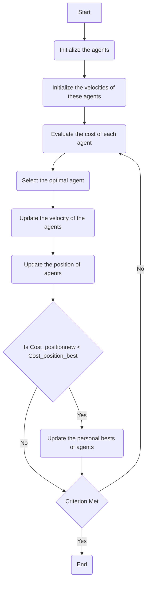

# About the projects

## Project 1 : Using Particle Swarm Optimizer to Optimize a Non-Convex Function

Particle Swarm Optimizer (PSO) is a type of bio-inspired optimization algorithm for finding the global minimum of a given problem. Modeled after animal swarms like flies, fish, and birds, PSO comprises several agents—points scattered throughout the solution space—which iteratively search for the global best solution. The agents explore the solution space while also moving towards the agent with the lowest cost such that all agents flock around the optimal solution at the end. Moreover, individual agents also have the memory of their personal best positions and only update their position when they find a better one. The velocity of the particles is governed by the inertia weight, which dictates how far the new position of the agent will be from its current position.

PSO is a metaheuristic optimization algorithm that does not need to make an assumption about the optimization problem. However, this also means that the algorithm may not always return accurate optimization results.

The PSO algorithm is as follows:

1. Initialize the agents of the swarm at random positions.
2. Evaluate the cost of each agent and find the global best agent, that is, the agent with the minimum cost.
3. Evaluate the velocities of the agents and update their positions.
4. If the cost of an agent’s current position is better than the cost of the personal best, update the personal best of the agent.
5. Repeat steps 2–4 until a criterion is met. This criterion can be a predetermined value of a global function or the number of iterations

  
